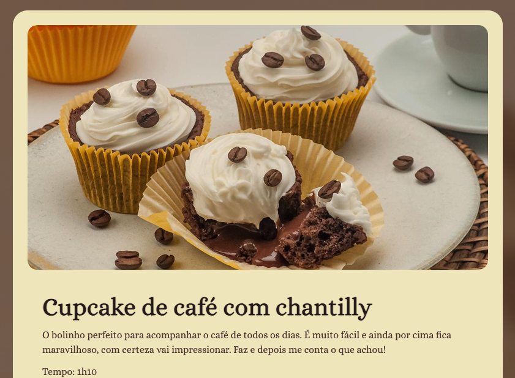

# 🧁 Página de Receita - Cupcake de Café



## 📋 Sobre o Projeto

Este é um projeto simples desenvolvido durante o curso FullStack da RocketSeat, focado na criação de uma página web responsiva para exibir receitas culinárias. O projeto apresenta uma receita de **Cupcake de Café com Chantilly**, com layout moderno e design atrativo.

## 🌐 Demo Online

**[Acesse o projeto aqui](https://rafaelrhp.github.io/Pagina-de-Receita/)**

## ✨ Funcionalidades

- **Layout Responsivo**: Adaptável a diferentes tamanhos de tela
- **Design Moderno**: Interface limpa e atrativa
- **Receita Completa**: Inclui ingredientes, modo de preparo e informações nutricionais
- **Tipografia Elegante**: Utiliza fonte Alice para melhor legibilidade
- **Elementos Visuais**: Imagens e ícones para melhor experiência do usuário

## 🛠️ Tecnologias Utilizadas

- **HTML5**: Estrutura semântica e acessível
- **CSS3**: Estilização moderna com flexbox e grid
- **Google Fonts**: Fonte Alice para tipografia elegante
- **SVG**: Ícones vetoriais (coração no footer)

## 📁 Estrutura do Projeto

```
Pagina-de-Receita/
├── assets/
│   ├── bg.jpg          # Imagem de fundo
│   ├── heart.svg       # Ícone de coração
│   ├── img-Readme.png  # Preview do projeto
│   └── main-image.jpg  # Imagem principal da receita
├── index.html          # Página principal
├── style.css           # Estilos CSS
└── README.md           # Documentação
```

## 🎨 Características do Design

- **Paleta de Cores**: Tons neutros e elegantes
- **Layout em Grid**: Organização clara das seções
- **Imagens Otimizadas**: Carregamento rápido e qualidade visual
- **Footer Personalizado**: Créditos com link para GitHub

## 🚀 Como Executar

1. Clone o repositório:

```bash
git clone https://github.com/rafaelrhp/Pagina-de-Receita.git
```

2. Abra o arquivo `index.html` em seu navegador

3. Ou acesse diretamente: [https://rafaelrhp.github.io/Pagina-de-Receita/](https://rafaelrhp.github.io/Pagina-de-Receita/)

## 📱 Responsividade

O projeto foi desenvolvido com foco na responsividade, garantindo uma boa experiência em:

- 📱 Dispositivos móveis
- 💻 Desktops
- 📺 Tablets

## 👨‍💻 Autor

**Rafael Pedrini**

- GitHub: [@rafaelrhp](https://github.com/rafaelrhp)
- Projeto desenvolvido durante o curso FullStack da RocketSeat

---

<div align="center">
  <p>Feito com ❤️ por <a href="https://github.com/rafaelrhp">Rafael Pedrini</a></p>
</div>
